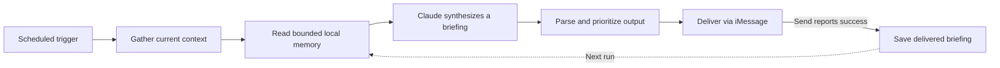

# AI workflow tooling & automation

Scheduled AI briefings that turn calendar events, email, reminders, and weather into a concise message you can act on. Morning and evening runs share bounded, persistent memory so each briefing can build on recent context. Built with Python, Claude, Google APIs, SQLite, and macOS integrations.

This repository is a concrete workflow example linked from [Andy Chiu’s portfolio — Autonomous agent tooling & workflows](https://andyachiu.github.io/#work). The interesting work is the connection between context, model output, and dependable delivery: gathering the right inputs, giving the model a bounded task, and handling the operational details around it.

[Explore the implementation](#how-a-briefing-works) · [Persistent memory](docs/MEMORY.md) · [Setup and operations](scripts/README.md) · [Roadmap](docs/ROADMAP.md)

## What's Here

| Workflow | User benefit | Implementation |
|---|---|---|
| Morning brief | See the day's schedule, time-sensitive email, reminders, and a suggested focus together | [Morning briefing](scripts/morning_brief.py) |
| Evening brief | Prepare for tomorrow with a look-ahead and pending-reply summary | [Evening briefing](scripts/evening_brief.py) |
| Persistent briefing memory | Carry recent delivered briefings and explicit presentation preferences into later runs | [Memory behavior and controls](docs/MEMORY.md) |
| Appointment check | Get a targeted reminder when an allergy-shot appointment is missing from the next 30 days | [Deterministic Calendar check](scripts/allergy-shot-check/README.md); no model call |
| Assistant-invoked brief | Use a documented briefing workflow inside a configured Claude Code session | [Morning-brief skill](.claude/skills/morning-brief/SKILL.md); separate from the scheduled Python pipeline |

## How a briefing works

The scheduled workflow owns the sequence of operations. It gathers fresh context and recent briefing memory, asks Claude to synthesize a briefing, formats the result, and delivers it through Messages.



1. **Gather context.** Fetch Calendar events and unread Gmail metadata/snippets through direct REST calls, read due/overdue Apple Reminders from the local database, and request a weather summary. The morning and evening entrypoints select their own time windows and prompt context.
2. **Recall and synthesize.** Retrieve the recipient’s three most recent delivered briefings from the last seven days, plus explicitly saved presentation preferences. Pass this historical context and the prefetched information to Claude in one request with a JSON output format. Day-specific instructions support a Monday week-ahead view and Friday next-week preparation.
3. **Make the output useful.** Parse the response and format it into readable sections. Content prioritization and a 1,200-character delivery limit keep the message concise; malformed JSON has a text fallback.
4. **Deliver and surface failures.** Shell wrappers refresh Google tokens and run the briefing. Authentication and delivery failures surface through non-zero exits and logs; failure notifications are attempted through iMessage. Some optional input failures, such as unavailable weather, degrade gracefully.
5. **Remember what was delivered.** After the send function reports success, save the final message in a private local SQLite database. Failed deliveries and stdout previews are not remembered. History is capped at 14 briefings, and expired entries are pruned on access; saved preferences remain until removed.

### A concrete example

*Illustrative inputs and output, not a captured run.*

| Input | What it contributes |
|---|---|
| Calendar: project review at 10 AM | A time constraint |
| Email snippet: feedback requested before the review | A possible preparation priority |
| Reminder: bring discussion notes | A task to include |

If a previous briefing mentioned preparing review notes, the next run can connect that preparation to the current review and feedback request. History is supporting context: it cannot establish that the notes were completed or that an old request is still open.

The briefing can bring those signals together: a schedule section, an email highlight, a reminder, and a suggested focus. It helps the reader decide what to do next. The scheduled program does not reply to the email or change the meeting.

## Where the agent concepts appear

| Portfolio concept | Evidence in this repository |
|---|---|
| **Context** | Fresh Calendar, Gmail, Reminders, and weather inputs assembled before the model call |
| **Tools and integrations** | Python API clients and shell/macOS integrations run in a prescribed sequence; the optional assistant skill describes connector-based work inside an agent host |
| **Action** | Briefing delivery through Messages; operational wrappers handle auth refresh and scheduled execution |
| **Memory** | SQLite persists delivered briefing text and explicit presentation preferences across runs; bounded retrieval feeds both morning and evening model requests |

The scheduled Python implementation is a bounded AI workflow. It does not expose tool definitions to the model, run a model-directed terminal tool loop, or import general chat history as model context. The broader portfolio's note-comparison example remains illustrative; this repository implements briefing memory, not Obsidian note comparison. See [`call_briefing_model`](scripts/shared/briefing_common.py) for the actual model boundary.

## Design choices worth exploring

- **Use history without treating it as fresh evidence.** Model instructions distinguish earlier briefings from current source inputs; the program saves only delivered output and user-entered preferences. This is bounded continuity, not automatic fact learning.
- **Keep orchestration explicit.** Data fetching happens before the model request. Integration failures can be inspected independently from the model's synthesis.
- **Design for the destination.** A useful phone briefing needs prioritization and constrained formatting, not just a long model response.
- **Separate updates from delivery.** A dedicated update job fetches code and syncs dependencies before the briefing schedule. A failed update need not block a later briefing from using the existing checkout.
- **Treat operating-system behavior as part of the product.** Keychain access, OAuth expiry, macOS permissions, sleep, and Messages delivery all affect whether a useful result reaches the user.

These are implementation choices, not measured performance or availability claims. The default deployment depends on a configured Mac being available; an always-on hosted service is not included.

## Read the code

| Area | Start here |
|---|---|
| Task context and output formatting | [`morning_brief.py`](scripts/morning_brief.py), [`evening_brief.py`](scripts/evening_brief.py) |
| Model request, response parsing, and delivery | [`shared/briefing_common.py`](scripts/shared/briefing_common.py) |
| Calendar and Gmail adapters | [`shared/google_api.py`](scripts/shared/google_api.py) |
| Persistent memory and local controls | [`shared/memory.py`](scripts/shared/memory.py), [`briefing_memory.py`](scripts/briefing_memory.py) |
| Local reminder context | [`shared/reminders.py`](scripts/shared/reminders.py) |
| Authentication lifecycle | [`oauth_setup.py`](scripts/oauth_setup.py), [`shared/refresh_tokens.py`](scripts/shared/refresh_tokens.py) |
| Scheduled entrypoints | [`run_morning_brief.sh`](scripts/run_morning_brief.sh), [`run_evening_brief.sh`](scripts/run_evening_brief.sh) |
| Scheduling and updates | [`install_launch_agents.py`](scripts/install_launch_agents.py), [`deploy.sh`](scripts/deploy.sh), [`plists/`](plists/) |
| Verification | [`tests/`](scripts/tests/) |

## Setup and operations

The scheduled scripts use macOS, Keychain, Messages, Google OAuth, an Anthropic API key, and Python **3.13.6** managed with `uv`. Account access and local permissions are needed to run them. No credentials or live personal data are needed to read the implementation.

Follow the [setup and operations guide](scripts/README.md) for installation, authentication, manual execution, and scheduling. Running a briefing sends an actual iMessage to the configured recipient. The [troubleshooting guide](scripts/TROUBLESHOOTING.md) covers auth, permissions, and delivery issues.

### Scheduling

These are the defaults encoded in the versioned launchd templates, not a claim about the current state of any machine. Render local plists with `install_launch_agents.py`; do not hand-edit generated files.

| Job | Default local schedule | Purpose |
|---|---|---|
| `deploy` | 6 AM weekdays | Fast-forward `main` and sync dependencies |
| `morning-brief` | 7 AM weekdays; 9 AM weekends | Today's briefing |
| `evening-brief` | 9 PM daily | Tomorrow's look-ahead |
| `allergy-shot-check` | 9 AM Monday, Wednesday, Friday | Appointment check |

### Tests

From `scripts/`, the focused unit/operational suite is:

```bash
uv run pytest tests/test_memory.py tests/test_morning_brief.py tests/test_reminders.py tests/test_launch_agents.py tests/test_operational_scripts.py
```

The separate `test_environment.py` checks the actual local macOS setup and Keychain. See the [operations guide](scripts/README.md#verify-your-setup) before running environment checks or production entrypoints.

## TODO / Ideas

Persistent briefing memory is implemented; see its [controls and limitations](docs/MEMORY.md). The [workflow roadmap](docs/ROADMAP.md) tracks future Obsidian integration, a standalone offline walkthrough, and evaluation of whether remembered context improves briefing quality. Those follow-ups remain planned.

## Latest Updates

- **Persistent briefing memory (2026-09-11)** — Added shared SQLite history, explicit preferences, bounded retrieval and retention, local inspect/delete controls, and offline persistence/failure-path tests.
- **Portfolio narrative and reader guide (2026-09-11)** — Reorganized the README around the implemented workflow, added a code map and illustrative example, clarified the model/memory boundary, and moved the detailed backlog to the roadmap.
- **Usability and reliability enhancements (2026-05-26)** — Improved logging, content prioritization, preflight diagnostics, and plist reload support.
- **Wake scheduling documentation (2026-05-25)** — Documented local Mac availability and scheduling limitations in the operations guide.
- **Interactive-shell permissions documentation** — Added troubleshooting for terminal-specific Full Disk Access.
